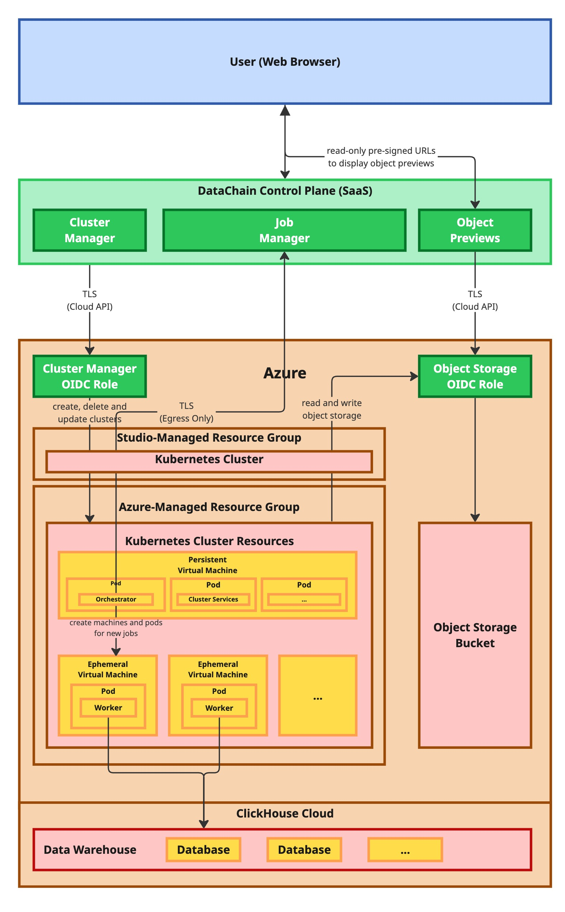

# Supporting Infrastructure for DataChain Compute Clusters on Azure

This repository contains the supporting infrastructure (OIDC, roles, resource group, etc.) needed to grant DataChain Studio enough permissions to manage compute clusters on Azure, and for those clusters to access the designated storage accounts.

## Setup

1. Update `variables.tf` with values specific to your deployment.
1. [Install Terraform](https://developer.hashicorp.com/terraform/install)
1. Run `terraform init`
1. Run `terraform apply`
1. Run `terraform output` and copy the output values

## Overview

### 1. **Resource Group**
- **`azurerm_resource_group.datachain`**: Central resource group to organize and manage all related compute and storage resources for the DataChain Compute Clusters.

### 2. **Identity and Access Management (IAM)**
- **Azure AD Applications**:
  - `datachain_oidc_compute`: Represents the identity used by DataChain Studio to provision and manage compute resources.
  - `datachain_oidc_storage`: Represents the identity used by DataChain Studio to access storage resources.
- **Service Principals**:
  - Created for both OIDC applications above, allowing authentication and role assignment.
- **Federated Identity Credentials**:
  - Define OIDC-based trust between DataChain Studio and Azure AD applications, using a specific issuer and subject claim.

### 3. **Role Definitions and Assignments**
- **Custom Role: Compute (`azurerm_role_definition.datachain_oidc_compute`)**:
  - Grants permissions to manage AKS clusters and assign managed identities within the resource group.
  - Assigned to the `datachain_oidc_compute` service principal on the resource group scope.

- **Custom Role: Storage (`azurerm_role_definition.datachain_oidc_storage`)**:
  - Grants permissions to read/write/delete storage accounts and containers.
  - Assigned to the `datachain_oidc_storage` service principal on each authorized storage account.

### 4. **Storage Accounts**
- **`azurerm_storage_account.datachain_oidc_storage`**:
  - Retrieves information from the storage accounts that DataChain jobs should have access to.

## Security Considerations

1. **Least Privilege Access**:
   - Custom role definitions limit actions to only those required for compute and storage operations.

2. **OIDC-based Federation**:
   - Federated identity credentials eliminate the need for long-lived secrets, enabling secure and auditable access from DataChain Studio.

3. **Scoped Role Assignments**:
   - Storage permissions are granted only to explicitly defined accounts.
   - Compute permissions are limited to a single resource group.

4. **AKS Resource Group Boundaries**:
   - Permissions for the compute role are restricted to a single Resource Group, under which the AKS Compute clusters are created.
   - AKS will automatically create additional resource groups prefixed with `MC_` to host internal infrastructure like virtual networks and managed node pools. 

## Variables

| Name                    | Description                                       | Example                                  |
|-------------------------|---------------------------------------------------|------------------------------------------|
| `az_subscription_id`    | Azure subscription ID                             | `00000000-0000-0000-0000-000000000000`   |
| `az_location`           | Azure region where resources will be deployed     | `"East US"`                              |
| `oidc_provider`         | OIDC issuer URL (used in federated identity)      | `"studio.datachain.ai/api"`              |
| `oidc_condition_compute`| OIDC subject string for compute role              | `"credentials:example-team/datachain-compute"` |
| `oidc_condition_storage`| OIDC subject string for storage role              | `"credentials:example-team/datachain-storage"` |
| `storage_buckets`       | Map of resource group names to storage account names | `{ "example-resource-group" = "examplestorageaccount" }` |

## Outputs

| Name                                     | Description                                             |
|------------------------------------------|---------------------------------------------------------|
| `datachain_compute_azure_subscription_id`| Subscription ID used for compute                        |
| `datachain_compute_azure_tenant_id`      | Azure tenant ID for compute resources                   |
| `datachain_compute_azure_client_id`      | Client ID of the compute Azure AD application           |
| `datachain_storage_azure_subscription_id`| Subscription ID used for storage                        |
| `datachain_storage_azure_tenant_id`      | Azure tenant ID for storage resources                   |
| `datachain_storage_azure_client_id`      | Client ID of the storage Azure AD application           |
| `datachain_compute_resource_group`       | Name of the resource group used for AKS and compute     |

## Architecture Overview for DataChain Compute Clusters

DataChain Studio operates in two main components:

- **Control Plane** — typically hosted and managed by DataChain as a SaaS platform.
- **Compute & Data Plane** — deployed within your Azure subscription, including:
  - Kubernetes clusters (e.g., AKS) provisioned through OIDC-authenticated access.
  - Blob storage accounts accessed securely using fine-grained roles and federated identities.
